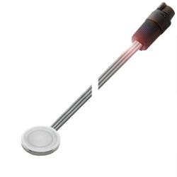
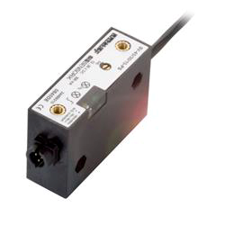

# LickDetector
Capacitive sensor with sensitivity adjustement to detect mouse licks

_____

The device is provided by [Sentronic](https://www.sentronic.com/) and comrpises two parts :

- The ``capacitive sensor`` : 

	SIE Sensork [ **SK-3-18/2.5-B-VA/PTFE (CS001A)**](https://www.sentronic.com/frontend/scripts/index.php?setMainAreaTemplatePath=mainarea_productdetail.html&productId=23227)

	

- The ``amplifier / digitizer`` : 

	SIE Sensorik [ **SV-45/30/15-PS (AE009E)**](https://www.sentronic.com/frontend/scripts/index.php?setMainAreaTemplatePath=mainarea_productdetail.html&productId=23210)

______

The ``capacitive sensor`` plugs into the ``digititzer`` with a polarized connector (no possibility of messing up this part)

The polarity of the 3 wires for the digitizer are :

| Wire color | Rated voltage | Description |
| ---------- | ------------- | ----------- |
| Black      |               |             |
| Blue       |               |             |
| Brown      |               |             |
